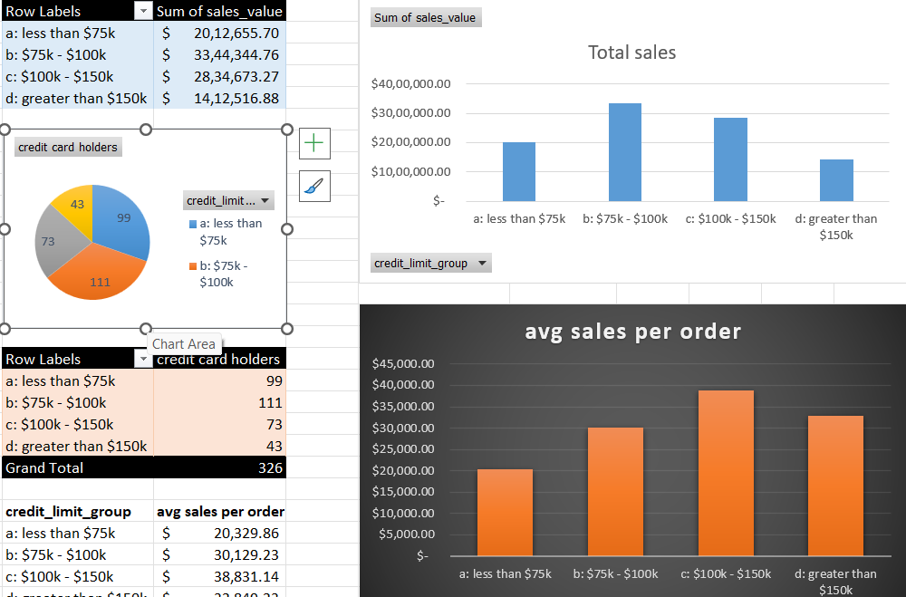
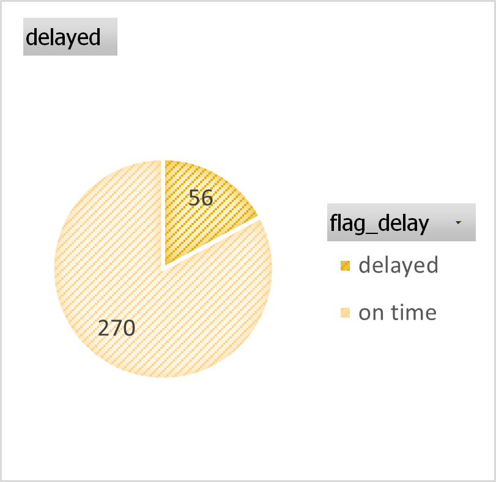
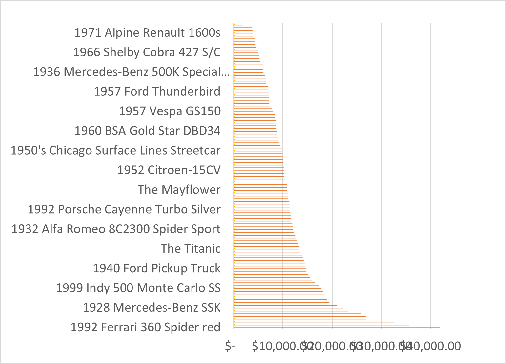

# Classic Models | Purchase & Sales Analysis

This project analyzes sales and purchase performance for the **Classic Models** company using **Power BI** and **Excel**.  
The report helps understand **which product lines, countries, and customers drive revenue and profit**, and how sales evolve over time.

The solution combines:

- A **Power BI dashboard** for interactive exploration  
- **Excel pivot tables & charts** for supporting purchase and customer behavior analysis  
- Clean **data model + DAX measures** for reusable business metrics  

---

## 📌 Business Objective

> Provide a unified view of Classic Models’ sales and purchases to support decisions on **profitable product lines, key markets, and high-value customers**.

Specifically, the report answers:

- Which **product lines** generate the highest sales and profit?
- How do **sales and net profit** trend over time (MoM, YTD)?
- Which **offices and customer countries** contribute most to revenue?
- What is the **average sales value per order**?
- How do **customer segments** behave by **credit limit, delays, and order mix** (via Excel analysis)?

---

## 🧩 Dataset

- Source: **Classic Models** sample sales data (orders, customers, products, offices)
- Main table: `Sales Data for Power BI`
- Key columns:  
  `ordernumber`, `orderdate`, `office_country`, `customer_country`,  
  `productLine`, `productName`, `QuantityOrdered`, `sales_value`, `cost_of_sales`, `buyPrice`, `customer_credit_limit`, etc.

---

## 🛠️ Tech Stack

- **Power BI Desktop**
  - Data Model, Relationships
  - Power Query for basic cleaning & transformation
  - **DAX measures** for KPIs and time intelligence
- **Microsoft Excel**
  - Pivot tables
  - Conditional formatting
  - Supporting charts for purchase / credit analysis
- **GitHub** for version control and documentation

---

## 📊 Power BI Report – Highlights

### Page 2 – Sales Overview (Decomposition Tree & Time Analysis)

- **Decomposition tree** showing how **Net Profit** breaks down by:
  - Customer Country → Product Line → Customer Name
- **Sales overview table** with:
  - Monthly Sales Value
  - **MoM% change**
  - **YTD Sales**

### Page 1 – Sales Dashboard

- **KPIs**
  - Total Sales
  - Net Profit
  - Count of unique orders
  - Average value of each order
- **Visuals**
  - Bar chart: **Sales by Product Line**
  - Scatter/line: **Sales by Cost of Sales** (relationship between revenue and cost)
  - Donut chart: **Sales by Office**
  - Column chart: **Sales by Customer Country**
  - Time-series: **Total Sales over time**
  - Time-series: **Count of unique orders**
  - Time-series: **Average value of each order**

- **Filters / Slicers**
  - Date range (from–to)
  - Office city
  - Customer city
  - Product line
  - Customer

These allow users to drill into specific regions, product lines, and customer segments.

---

## 📈 Excel Analysis – Purchase & Customer Behavior

In addition to Power BI, exploratory purchase and customer analysis was done in Excel:

- **Credit limit groups vs total sales**
  - Pivot table + bar chart for total sales by credit limit band  
  - KPI: **average sales per order** per credit limit group
- **Credit card holders vs non-holders**
  - Pie chart showing number of customers with/without credit cards
- **Delivery performance**
  - Pie chart showing **% of delayed vs on-time orders**
- **Purchase difference analysis**
  - Conditional formatting on `purchase_diff` to highlight customers with high positive/negative differences
- **Purchase mix heatmap**
  - Heatmap of product line combinations per order (e.g. Classic Cars vs Motorcycles, Planes, Ships etc.)
- **Top purchases by product**
  - Sorted bar chart of highest purchase amounts by product name
- **Sales by office vs customer country**
  - Bar chart visual comparing total sales by **office_country** and **customer_country**

These Excel views complement the Power BI report and demonstrate traditional BI + spreadsheet skills.

---

## 🧮 Key DAX Measures

Below are the most important DAX measures used in the report.

### 🔹 Average Sales Value per Order

```DAX
Average Sales Value per Order =
DIVIDE(
    SUM ( 'Sales Data for Power BI'[sales_value] ),
    DISTINCTCOUNT ( 'Sales Data for Power BI'[ordernumber] )
)
```

### 🔹 Net Profit

```DAX
Net Profit =
VAR SalesValue =
    SUM ( 'Sales Data for Power BI'[sales_value] )
VAR CostValue =
    SUM ( 'Sales Data for Power BI'[cost_of_sales] )
RETURN
    SalesValue - CostValue
```

### 🔹 Sales Value MoM%

```DAX
sales_value MoM% =
IF(
    ISFILTERED ( 'Sales Data for Power BI'[orderdate] ),
    ERROR (
        "Time intelligence quick measures can only be grouped or filtered
        by the Power BI-provided date hierarchy or primary date column."
    ),
    VAR __PREV_MONTH =
        CALCULATE(
            SUM ( 'Sales Data for Power BI'[sales_value] ),
            DATEADD ( 'Sales Data for Power BI'[orderdate].[Date], -1, MONTH )
        )
    RETURN
        DIVIDE(
            SUM ( 'Sales Data for Power BI'[sales_value] ) - __PREV_MONTH,
            __PREV_MONTH
        )
)
```

### 🔹 Sales Value YTD

```DAX
sales_value YTD =
IF(
    ISFILTERED ( 'Sales Data for Power BI'[orderdate] ),
    ERROR (
        "Time intelligence quick measures can only be grouped or filtered
        by the Power BI-provided date hierarchy or primary date column."
    ),
    TOTALYTD(
        SUM ( 'Sales Data for Power BI'[sales_value] ),
        'Sales Data for Power BI'[orderdate].[Date]
    )
)
```

### 🔹 Selected Metric (Dynamic Toggle Between Sales & Net Profit)

```DAX
Selected Metric =
VAR SalesValue =
    SUM ( 'Sales Data for Power BI'[sales_value] )
VAR ProfitValue =
    SalesValue
        - SUM ( 'Sales Data for Power BI'[cost_of_sales] )
RETURN
    SWITCH(
        SELECTEDVALUE ( 'measures table'[Number ID] ),
        1, SalesValue,
        2, ProfitValue,
        SalesValue
    )
```

## 🔗 Data Model


## 📊 Power BI Dashboard Screenshots

### Page 1 – Sales Dashboard


### 📄 Page 2 – Profit Decomposition


## 📈 Excel Purchase Analysis

### Excel Dashboard for Purchase Analysis


### Delayed Orders


### Sales Overview


### Sales per Country


### Purchase Orders Heatmap


## 📁 Project Structure
```
Classic-Models-Purchase-Analysis/
│
├── PowerBI/ → Dashboard PBIX (only snapshots)
├── excel-analysis-screenshots
├── excel
├── screenshots
└── README.md
